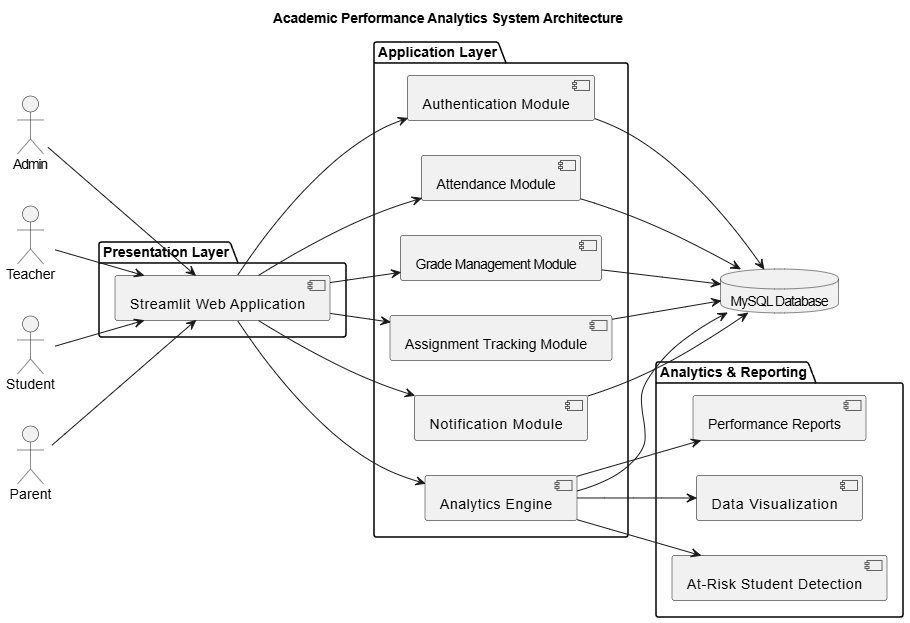
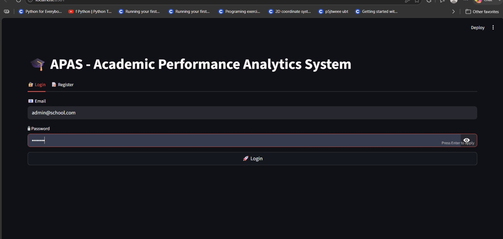
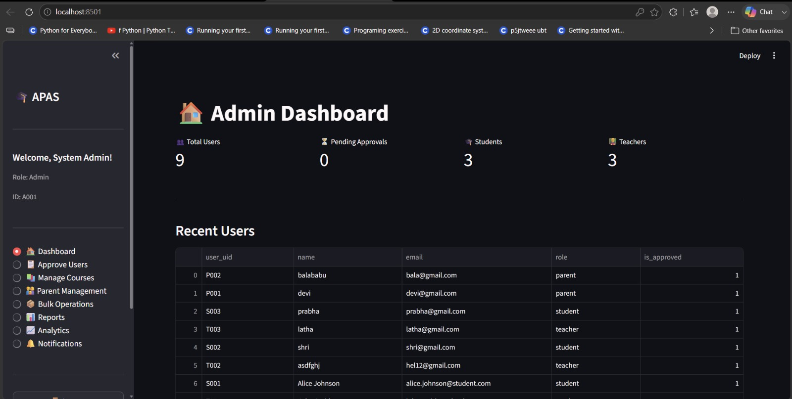
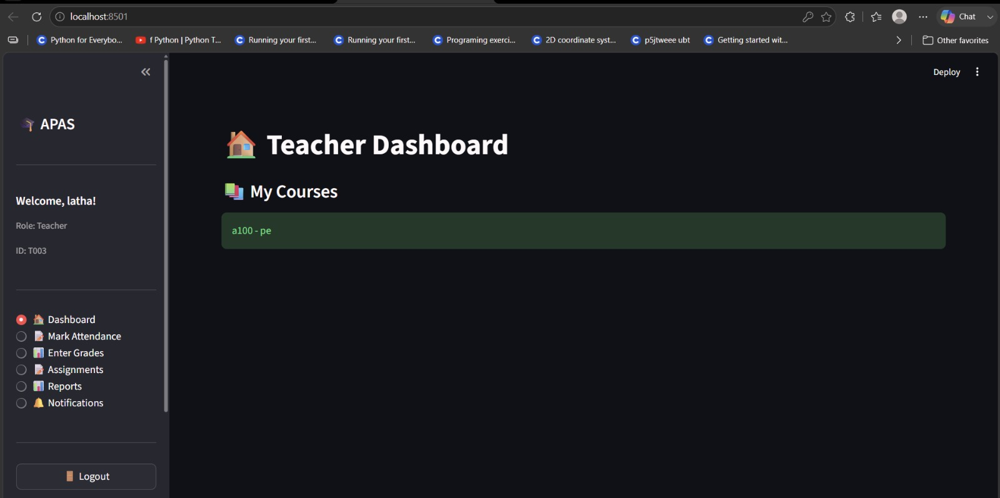
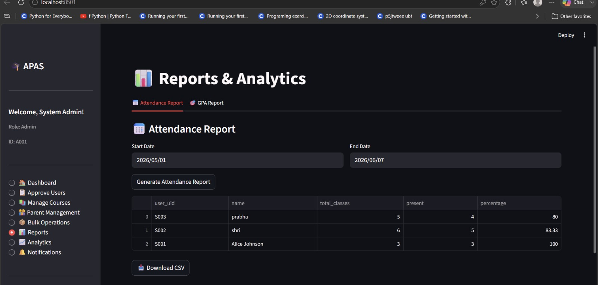
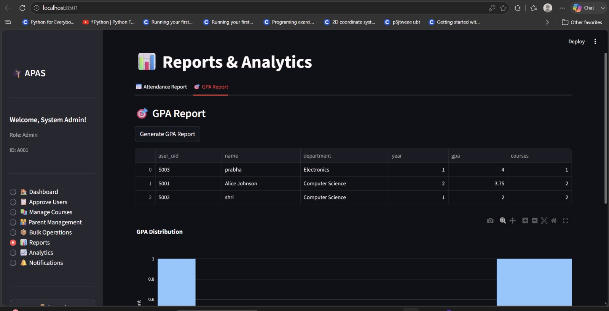
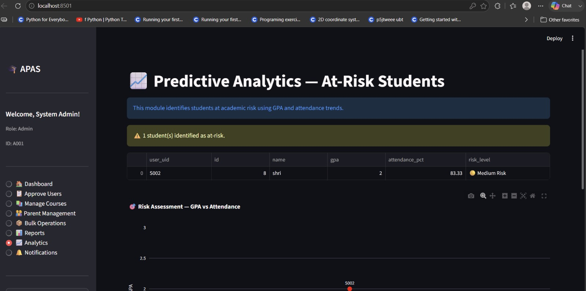

# 🎓 Academic Performance Analytics System (APAS)

## 🎥 Project Demo

<demo.mp4>
A short demonstration of the Academic Performance Analytics System showcasing role-based access, attendance tracking, GPA reporting, and predictive analytics.

## 📌 Overview

Academic Performance Analytics System (APAS) is a role-based web application designed to streamline academic monitoring and performance analysis within educational institutions.

The platform enables Administrators, Teachers, Students, and Parents to manage attendance, grades, assignments, notifications, and academic reports through dedicated dashboards.

A key feature of the system is its Predictive Analytics Module, which identifies academically at-risk students using GPA and attendance trends, enabling early intervention and improved academic outcomes.

---

## ⭐ My Contribution

**Role:** Team Lead

**Team Size:** 4 Members

**Project Management:** Jira (Agile Methodology)

### Responsibilities

* Led a team of 4 members throughout the project lifecycle
* Managed sprint planning and task allocation using Jira
* Coordinated development activities and tracked project progress
* Contributed to backend feature development using Python
* Contributed to analytics and reporting functionalities
* Performed testing and debugging of assigned modules
* Assisted in project integration and final delivery

### Skills Demonstrated

* Team Leadership
* Agile Project Management
* Jira Workflow Management
* Backend Development
* Database Integration
* Data Analytics
* Debugging & Testing
* Team Collaboration

---

## 🛠️ Technology Stack

### Frontend

* Streamlit

### Backend

* Python

### Database

* MySQL

### Data Processing & Visualization

* Pandas
* NumPy
* Plotly

### Project Management

* Jira

---

## 🚀 Key Features

### Authentication & Authorization

* Secure login and registration system
* Role-based access control
* Session management
* User approval workflow

### Admin Dashboard

* Institutional statistics overview
* User approval management
* Course management
* Parent management
* Bulk operations

### Teacher Dashboard

* Attendance management
* Grade entry and updates
* Assignment management
* Student performance tracking

### Student Dashboard

* Attendance monitoring
* GPA tracking
* Assignment tracking
* Academic progress monitoring

### Parent Dashboard

* Child performance monitoring
* Attendance visibility
* Academic progress tracking

### Reports & Analytics

* Attendance reports
* GPA reports
* CSV export functionality
* Interactive visualizations
* Performance analysis dashboards

### Predictive Analytics

* At-risk student identification
* GPA vs Attendance analysis
* Risk-level classification
* Early intervention support

### Notification System

* Academic alerts
* Administrative announcements
* User notifications

---

## 🏗️ System Architecture



---

## 📷 Application Screenshots

### Login Page



### Admin Dashboard



### Teacher Dashboard



### Attendance Report



### GPA Report



### Predictive Analytics Dashboard



---

## 📈 Project Impact

* Centralized academic data management
* Automated attendance and GPA reporting
* Improved visibility for teachers and parents
* Enhanced student performance monitoring
* Early identification of academically at-risk students
* Reduced manual report generation effort
* Improved accessibility of academic insights

---

## 👥 Team Information

This project was developed by a team of 4 members using Agile development practices and Jira for sprint planning and project tracking.

### Team Lead

Shriya Shetty

### Team Members

* Shriraksha
* Shrusti
* Shrujani

---

## ⚙️ Installation

### Clone the Repository

```bash
git clone https://github.com/your-username/academic-performance-analytics-system.git
```

### Navigate to Project Directory

```bash
cd academic-performance-analytics-system
```

### Install Dependencies

```bash
pip install -r requirements.txt
```

### Configure Database

1. Install MySQL
2. Create the required database
3. Import the SQL schema
4. Update database credentials in the configuration file

### Run the Application

```bash
streamlit run app.py
```

---

## 🔮 Future Enhancements

* Machine Learning-based performance prediction
* Email and SMS notification integration
* Mobile application support
* Real-time analytics dashboard
* AI-powered academic recommendations
* Advanced student performance forecasting

---

## 📚 Academic Context

This project was developed as part of an academic software engineering initiative to demonstrate full-stack application development, role-based system design, data analytics, database management, and Agile project management practices.

---

## 📄 License

This project is intended for educational and learning purposes.
